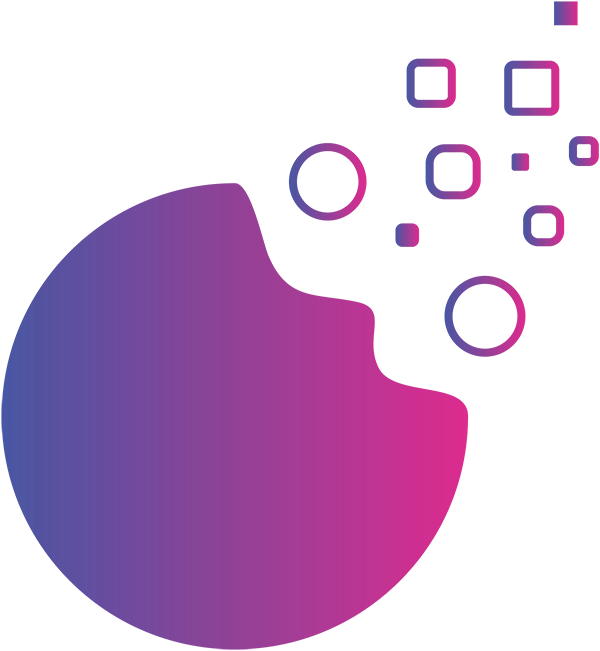
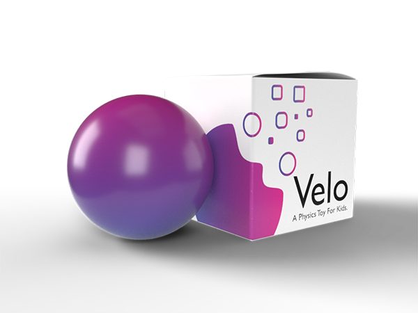

# velo

    

Web application for the front end of the velo project from the McGill Phyisics Hackathon 2018.

Velo is an interactive physics toy for young children that helps visualize physics concepts in a playful and creative way. Created to stimulate skillsets such as problem solving, curiosity, and interaction amongst young people.

The product is a bluetooth enabled ball that sends accelerometer data to a visual display in order to help users visualize changes in acceleration during interaction. With further development velo can be upgraded with 9 degrees of freedom sensors in order to visualize more physics concepts such as motion and impact.

Overall, velo is an interactive children's toy that aims to encourage learning through creation from play.

    

